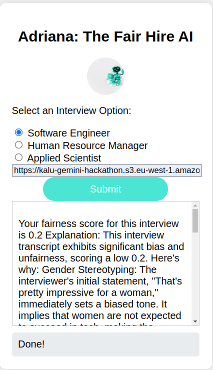

# Adriana: the Fair Hire AI

This project is an interview fairness scoring system leveraging Google Gemini and Vertex AI. The server component is implemented in Python, encapsulated in a Docker container, and the client/frontend is built using JavaScript/HTML. The service is accessible via port 8000, and the development environment is managed using Poetry.

## Table of Contents

- [Features](#features)
- [Architecture](#architecture)
- [Prerequisites](#prerequisites)
- [Getting Started](#Getting-Started)
- [Configuration](#configuration)
- [Usage](#usage)
- [Development](#development)
- [Contributing](#contributing)
- [License](#license)

## Features

- **Natural Language Processing (NLP)**: It uses Google Gemini API to understand the context and intent behind interview transcripts, ensuring accurate and relevant response.
- **Intuitive Interface**: The app interface is designed to be user-friendly. Built using Flutterflow, its frontend is optimized for both iOS and Android platforms, ensuring a consistent experience across devices.
- **Backend Integration**: Powered by Google Vertex AI, the backend handles the docker image and deployment of the service.
- **Dockerized Deployment**: Easy deployment using Docker.

## Architecture

1. **Client/Frontend**: 
    - Built with JavaScript/HTML.
    - Communicates with the server via HTTP requests.

2. **Server/Backend**:
    - Implemented in Python.
    - Encapsulated in a Docker container.
    - Deployed in Google Vertex AI platform

## Prerequisites

- Docker installed on the host machine.
- Poetry for Python dependency management.

## Getting Started

### Clone the Repository

```bash
git clone https://github.com/kalu-o/fairhire-ai.git
cd fairhire-ai
```

### Set Up the Python Environment

Install Poetry if you haven't already:

```bash
curl -sSL https://install.python-poetry.org | python3 -
```

Install the project dependencies:

```bash
poetry install
```

## Configuration

Configuration settings are realized through environment variables. The current setup requires an `openai api key` and `Google Gemini api key`. You can provide these while deploying in the Vertex AI environment.


### Build and Run the Docker Container


```bash
poetry build
poetry export -o requirements.txt
docker compose -f docker-compose.build.yaml up -d --build
```

## Usage

### Testing the endpoint

Open a web browser and navigate to `http://localhost:8000/docs` to access the fastapi interface.

### Using the App 

- Go to the app site https://fair-hire-ai.flutterflow.app/ (works on Desktop, tablets, and phones).
- Choose an interview option.
- Enter the URL that contains the recording.
- Click the 'Submit' button.
- Wait for the processing to finish.
The following are sample recordings for test purpose:


- Software Engineer: https://kalu-gemini-hackathon.s3.eu-west-1.amazonaws.com/software_engineer.wav
- Human Resource Manager: https://kalu-gemini-hackathon.s3.eu-west-1.amazonaws.com/human_resources_manager.wav
- Applied Scientist: https://kalu-gemini-hackathon.s3.eu-west-1.amazonaws.com/applied_scientist.wav





## Development

### Running the Server Locally

To run the server without Docker (useful for development):

```bash
poetry run fair_hire_ai_service
```


## Contributing

Contributions are welcome! Please fork the repository and create a pull request with your changes.

## License

This project is licensed under the MIT License - see the [LICENSE](LICENSE) file for details.
